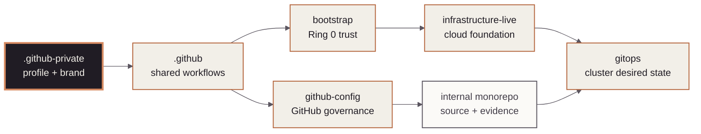

<!-- mindclade-doc: repository-home@2 -->
<!-- Brand source: mindclade/.github-private/mindclade-brand-assets (MONO family). -->

<p align="center">
  <picture>
    <source media="(prefers-color-scheme: dark)" srcset="mindclade-brand-assets/png/mono-wordmark-dark-1080w.png">
    <source media="(prefers-color-scheme: light)" srcset="mindclade-brand-assets/png/mono-wordmark-1080w.png">
    
  </picture>
</p>

<p align="center">
  
  
  
  
</p>

# Mindclade · Member Profile and Brand

> **Member experience · Private organization surface**
> Render Mindclade's member-only organization profile and preserve the canonical, self-hosted
> brand assets used across internal engineering surfaces.

| Repository contract | Value |
| --- | --- |
| Class | `enterprise-control` |
| Visibility | `private` |
| Change model | `pull-request` |
| Authority | `member-only-organization-profile`<br>`internal-navigation` |
| Start here | [`profile/README.md`](profile/README.md) |

## Mission

`.github-private` is GitHub's special private organization-profile repository. It gives members
a trusted navigation surface and stores Mindclade's canonical brand bundle. The repository name,
visibility, and `profile/README.md` path are part of GitHub's rendering contract.

## Authority boundary

### This repository creates

- The member-only organization profile and internal links to authoritative systems and support.
- The checked-in source bundle for approved CAPS and MONO images, fonts, web assets, and usage
  guidance.
- Offline validation that keeps the profile renderable and the asset provenance intact.

### This repository deliberately does not create

- Shared workflows or community-health defaults; those belong to `.github`.
- GitHub repositories, access, rulesets, or visibility; those belong to `github-config`.
- Cloud resources, Kubernetes state, application source, credentials, or incident records.

## Quick start

Run the credential-free repository and profile checks from the committed Nix closure:

```sh
nix flake check --no-update-lock-file
```

Expected result: the flake realizes the CI shell, then runs `make validate` and `make lint` with
its pinned actionlint, yamllint, Python, and Make tools. Required profile and brand files, local
links, asset provenance, action pins, and repository invariants pass. No validation command
publishes the profile or changes organization settings.

## Estate position

The highlighted node is this repository. The contract and boundary lists are the text equivalent
of its navigation and brand-source relationship to the engineering estate.



## Repository map

| Path | Purpose |
| --- | --- |
| `profile/README.md` | GitHub-rendered member organization profile. |
| `mindclade-brand-assets/` | Canonical images, fonts, tokens, web handoff, and brand guide. |
| `contracts/repository.yaml` | Repository authority and required paths. |
| `scripts/validate_repository.py` | Offline profile, asset, and safety validation. |
| `.github/` | CODEOWNERS, pull-request template, and validation workflow. |

## Change path

Change profile copy or brand assets through a reviewed pull request. Preserve upstream font
licenses and source hashes, render the profile from local assets, and verify every link before
merge. `github-config` remains the authority for repository visibility, access, and settings;
publishing or pushing is an explicit operator action.

## Documentation and support

- [Member profile](profile/README.md)
- [Brand asset guide](mindclade-brand-assets/README.txt)
- [Contributing](CONTRIBUTING.md)
- [Support](SUPPORT.md)
- [License](LICENSE)

## Security

Keep the profile and asset bundle non-secret. Never add credentials, incident records, private
keys, or sensitive operational data; use [the private security process](SECURITY.md).
