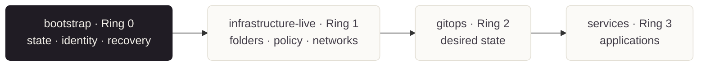

<!-- mindclade-doc: repository-home@2 -->
<!--
  Standard:  mindclade/.github -> standards/readme/enterprise-control.md
  Brand:     mindclade/.github-private/mindclade-brand-assets (MC family).
             Assets are committed under docs/assets/brand/ at 4x the rendered width.
             Never hotlink; a private repository cannot serve an external host.
  Fallback:  the  below is the ink-panel banner. It is the only asset that
             reads on both GitHub themes, and it is what renders when a client
             ignores <picture> (mobile app, GraphQL API, npm, IDE previews).
-->

<div align="center">
<picture>
  <source media="(prefers-color-scheme: dark)" srcset="mindclade-brand-assets/png/mc-lockup-horizontal-dark-1080w.png">
  <source media="(prefers-color-scheme: light)" srcset="mindclade-brand-assets/png/mc-lockup-horizontal-1080w.png">
  
</picture>

<p>
  <a href="contracts/repository.yaml"></a>
  
  <a href=".terraform-version"></a>
  <a href="LICENSE"></a>
</p>

<p>
  <a href="docs/README.md"><b>Documentation</b></a> ·
  <a href="docs/first-apply.md">First apply</a> ·
  <a href="docs/break-glass.md">Break glass</a> ·
  <a href="docs/state-recovery.md">State recovery</a> ·
  <a href="SECURITY.md">Security</a>
</p>

</div>

# Mindclade · Bootstrap

> **Platform Foundation · Ring 0**
> Durable state, seed projects, workload federation, automation identities, and audited
> break-glass recovery for the Mindclade control plane.

<!-- Mirrors contracts/repository.yaml. If the two disagree, the YAML is authoritative. -->

| Repository contract | Value |
| :--- | :--- |
| Enterprise | [`mindclade`](https://github.com/enterprises/mindclade) |
| Organization | [`mindclade`](https://github.com/mindclade) |
| Repository index | [Mindclade repositories](https://github.com/orgs/mindclade/repositories) |
| Repository | [`mindclade/bootstrap`](https://github.com/mindclade/bootstrap) |
| Class | `enterprise-control` |
| Visibility | `private` |
| Change model | Pull request to `main`; protected exact-plan apply |
| Documentation | [`docs/README.md`](docs/README.md) |

Mindclade's Ring-0 repository owns only the durable state, seed projects, external workload
federation, control-plane automation identities, and break-glass recovery needed to operate
the rest of the enterprise platform.

## Authority boundary



> [!IMPORTANT]
> If a change is not state, identity, seed projects, or recovery, it belongs in another
> repository. A bootstrap mistake can remove the identities and state needed to repair
> every other control repository.

**This repository creates**

- a protected bootstrap folder;
- a seed/state project and CI federation project;
- primary and cross-location replica state buckets with location-compatible CMEKs;
- repository-isolated GitHub Actions WIF providers;
- a signer-only monorepo provider restricted to the protected `release` environment;
- separate bootstrap, GitHub-governance, and infrastructure-live automation identities;
- a no-standing-permission break-glass account with critical alerting.

<details>
<summary><b>What this repository deliberately does not create</b></summary>

- normal organization folders, policy, billing governance, SCC, contacts, or log sinks;
- networks, workload projects, managed services, or GKE;
- artifact signer accounts, KMS signing keys, attestors, or their normal-plane IAM roles;
- Argo CD, Kubernetes desired state, or application source.

Those authorities remain in [`infrastructure-live`](https://github.com/mindclade/infrastructure-live),
[`gitops`](https://github.com/mindclade/gitops), and the internal monorepo.

</details>

## Quick start

The safe first action is validation, not planning or applying.

```sh
nix develop
make validate
make lint
make fmt-check
```

> [!NOTE]
> Expected result: shell, Terraform, WIF-policy, local-state, repository-contract, and
> license checks pass. `make plan-local` is reserved for the documented first apply or
> recovery path.

## Lifecycle

1. Perform the one-time first apply with `terraform init -backend=false`.
2. Migrate local state to the generated GCS bootstrap state bucket.
3. Securely destroy local state and plan copies.
4. Configure repository variables and the protected `plan`, `bootstrap`, and recovery-read
   environments.
5. All subsequent plans and applies use keyless GitHub OIDC and exact-plan approval.

## Commands

```sh
make validate
make lint
make fmt-check
make fmt
make plan-local       # only during documented recovery/first apply
```

## Repository map

| Path | Responsibility |
| :--- | :--- |
| `modules/projects/` | Bootstrap folder, seed/state project, CI federation project, APIs, KMS |
| `modules/identity/` | WIF providers, automation accounts, break-glass controls |
| `modules/state/` | State buckets, IAM, retention controls, and replication |
| `contracts/` | Supported output and repository authority contracts |
| `.github/workflows/` | Plan, protected apply, drift, validation, recovery-drill automation |
| `docs/` | First apply, operations, handoff, and recovery procedures |

## Documentation and safety

Start at the [documentation home](docs/README.md). Read
[first apply](docs/first-apply.md), [break glass](docs/break-glass.md),
[state recovery](docs/state-recovery.md), and
[automation secret bootstrap](docs/automation-secret-bootstrap.md) before touching live
Ring-0 state.

> [!CAUTION]
> Never commit local state, saved plans, credentials, private keys, or production tfvars.
> If a secret reaches a branch, rotate it first, then clean the history. Rewriting history
> is not remediation.

## Contributing

Read [`CONTRIBUTING.md`](CONTRIBUTING.md) before opening a pull request. Organization-wide
conventions live in [`mindclade/.github`](https://github.com/mindclade/.github); this
repository's file adds only what is specific to it.

> [!IMPORTANT]
> Never bypass Git for a routine change. A change applied outside the reviewed path leaves
> no plan, no approval, and no record.

## Security

> [!WARNING]
> Do not open a public issue for a vulnerability.

Report through [a private security advisory](https://github.com/mindclade/bootstrap/security/advisories/new)
or `security@mindclade.com`. Acknowledgement within 2 business days, triage within 5.
Good-faith research is covered by safe harbour. Full policy: [`SECURITY.md`](SECURITY.md).

## License

`LicenseRef-Mindclade-Proprietary` — see [`LICENSE`](LICENSE). First-party configuration
and policy files carry the shared header defined in
[`license-header.txt`](license-header.txt).

## Related repositories

| Repository | Holds |
| :--- | :--- |
| [`infrastructure-live`](https://github.com/mindclade/infrastructure-live) | Folders, org policy, governance, networks, workload projects |
| [`gitops`](https://github.com/mindclade/gitops) | Argo CD and Kubernetes desired state |
| [`.github`](https://github.com/mindclade/.github) | Organization-wide conventions and canonical policies |

---

<div align="center">
  
  <p><sub>© 2026 Mindclade, LLC · Proprietary and confidential</sub></p>
</div>

<!-- mindclade-doc: repository-home@1 -->

<!-- Brand source: mindclade/.github-private/mindclade-brand-assets (MONO family). -->

<p align="center">
  <picture>
    <source media="(prefers-color-scheme: dark)" srcset="mindclade-brand-assets/png/mono-wordmark-dark-1080w.png">
    <source media="(prefers-color-scheme: light)" srcset="mindclade-brand-assets/png/mono-wordmark-1080w.png">
    
  </picture>
</p>

# Mindclade · Member Organization Profile

> **Member experience · Internal navigation and operating guidance**  
> The private profile rendered to Mindclade organization members by GitHub Enterprise Cloud.

| Repository contract | Value |
| --- | --- |
| Enterprise | [`mindclade`](https://github.com/enterprises/mindclade) |
| Organization | [`mindclade`](https://github.com/mindclade) |
| Repository index | [Mindclade repositories](https://github.com/orgs/mindclade/repositories) |
| Repository | [`mindclade/.github-private`](https://github.com/mindclade/.github-private) |
| Class | `enterprise-control` |
| Visibility | `private` |
| Production authority | `false` |
| Change model | Pull request to `main` with code-owner review |
| Rendered source | [`profile/README.md`](profile/README.md) |

GitHub renders `profile/README.md` in the member view of the Mindclade organization. This
repository is intentionally private: the name, visibility, and path are part of GitHub's
activation contract and must not be changed independently.

## Authority boundary

This repository owns only:

- the member-only organization profile;
- internal navigation to authoritative repositories, runbooks, and support routes; and
- validation that keeps the profile renderable and the repository free of obvious unsafe artifacts.

It does not own GitHub Enterprise desired state, reusable workflows, community-health defaults,
cloud or Kubernetes resources, application source, credentials, or incident records.

| Concern | Authoritative repository |
| --- | --- |
| Shared workflows and community health | [`mindclade/.github`](https://github.com/mindclade/.github) |
| GitHub organization governance | [`mindclade/github-config`](https://github.com/mindclade/github-config) |
| Ring-0 trust and recovery | [`mindclade/bootstrap`](https://github.com/mindclade/bootstrap) |
| Google Cloud desired state | [`mindclade/infrastructure-live`](https://github.com/mindclade/infrastructure-live) |
| Kubernetes and Argo CD desired state | [`mindclade/gitops`](https://github.com/mindclade/gitops) |
| Product and model source | [`mindclade/mindclade-internal-monorepo`](https://github.com/mindclade/mindclade-internal-monorepo) |

## Repository layout

```text
.github-private/
├── .github/
│   ├── CODEOWNERS
│   ├── PULL_REQUEST_TEMPLATE.md
│   └── workflows/validate.yml
├── contracts/repository.yaml
├── mindclade-brand-assets/
├── profile/README.md
├── scripts/validate_repository.py
├── CONTRIBUTING.md
├── SECURITY.md
├── SUPPORT.md
└── README.md
```

## Validation

CI and local development run the same credential-free command:

```sh
make validate
```

When actionlint and yamllint are installed, also run:

```sh
make lint
```

The workflow grants only `contents: read`, persists no checkout credential, uses no secrets,
and pins its only external action to a full commit SHA.

## Provisioning

`github-config` is the authoritative creator and settings manager for this repository. Its
catalog entry must keep the repository private, disable issues and projects, attach the normal
enterprise rulesets and custom properties, and grant Platform maintain, Security push, and
Engineering pull access.

Publishing, committing, pushing, and opening a pull request are separate operator actions and
are intentionally not performed by this repository's validation tooling.

The flattened PNG lockups in `mindclade-brand-assets/` are used for the rendered profile so
GitHub does not depend on local fonts to reproduce the brand correctly. The asset bundle is
proprietary and remains subject to `LICENSE`.

The web handoff under `mindclade-brand-assets/web/` is fully self-hosted. Its head snippet
preloads the local Instrument Sans WOFF2 face and loads JetBrains Mono on demand, along with
tokens, icons, manifest, and social image from the
`/mindclade-brand-assets/` deployment path; it makes no Google Fonts request. Upstream font
commits, file hashes, and OFL license mappings are recorded in
`mindclade-brand-assets/fonts/SOURCES.json`.
